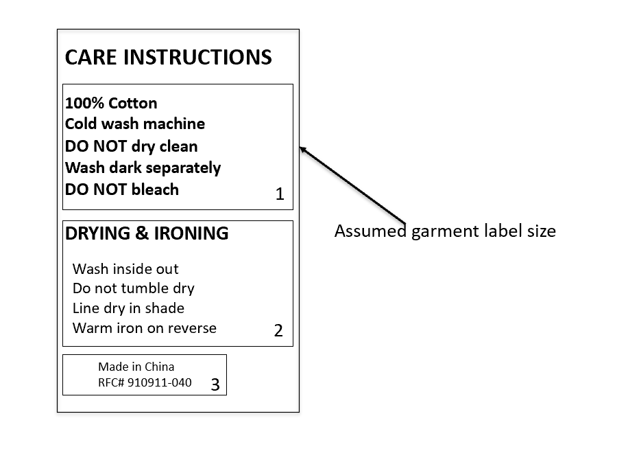

# HW1 Information Design (DIFFICULT)

## A) PowerPoint-style Layout

## Overall Structure
### Care label Design Image



---

## B) Conceptual Groups

### Group 1: PRIMARY WASHING INSTRUCTIONS

**Viewing order:** 1  
**Concept:** Core Washing Care - Essential washing method and restrictions

**Why view this first:**
This group contains the most critical information that prevents damage to the garment. Users need to know the fabric content (100% Cotton) and washing method (Cold wash) before they start washing. The "Do not" warnings (dry clean, bleach) are safety-critical and must be seen immediately to avoid ruining the item.

**What I emphasized:**
- Fabric content (100% Cotton) - bold, larger size
- Washing temperature/method (Cold wash machine) - bold
- Critical restrictions (Do not dry clean, Do not bleach) - bold, slightly larger size (16pt)
- Color care instruction (Wash dark separately) - bold

**What I de-emphasized:**
- The specific wording "machine" (could be implied)
- Repetitive "Do not" phrasing structure (kept but not over-emphasized)

**Visual tools combination used:**
**BOLD + SIZE HIERARCHY**
- Bold text for all primary instructions
- Size variation: 16pt for critical "Do not" warnings, 14pt for other instructions
- This combination creates immediate visual scanning hierarchy where warnings stand out through both weight and size

---

### Group 2: DRYING & IRONING INSTRUCTIONS

**Viewing order:** 2  
**Concept:** Secondary Care - Drying method and finishing care

**Why view this second:**
While important, these instructions are only relevant after washing is complete. Users typically wash first, then worry about drying and ironing. The information is necessary but not urgent during the initial washing decision.

**What I emphasized:**
- Drying restrictions (Do not tumble dry) - regular weight but clear line breaks
- Drying method (Line dry in shade) - clear formatting
- Ironing instructions (Warm iron on reverse) - included but not bold

**What I de-emphasized:**
- The "Wash inside out" instruction (moved here as it's less critical than washing method)
- Specific ironing temperature details (kept simple: "Warm")

**Visual tools combination used:**
**INDENTATION + REGULAR WEIGHT (non-bold)**
- Indented 12pt from left margin to show it's secondary to primary washing instructions
- Regular weight (not bold) text to create visual hierarchy below the bold primary instructions
- This combination uses spatial positioning (indentation) and typographic weight to create clear information hierarchy

---

### Group 3: PRODUCT INFORMATION

**Viewing order:** 3  
**Concept:** Manufacturing Details - Origin and reference codes

**Why view this third:**
This information is not needed for care decisions. It's legal/compliance information that may be useful for returns or tracking but doesn't affect how the user cares for the garment. Placing it last ensures it doesn't distract from critical care instructions.

**What I emphasized:**
- Nothing - this is intentionally de-emphasized

**What I de-emphasized:**
- Everything in this group - smaller font (10pt), further indentation (24pt), regular weight
- The RFC# code (kept but minimal formatting)

**Visual tools combination used:**
**SIZE REDUCTION + INCREASED INDENTATION**
- Smaller font size (10pt vs 14pt/13pt above) to reduce visual weight
- Increased indentation (24pt vs 12pt/0pt) to push it visually to the background
- This combination uses both size and spatial positioning to minimize visual importance while still keeping the information accessible

---

## C) Short Answers

### 1) Who is reading this information?

**Answer:** People who own or are about to wash a garment, typically:
- Someone doing laundry at home (before washing)
- Someone checking care instructions before purchasing
- Someone preparing to wash the item for the first time
- Anyone who needs to know how to properly care for the garment

### 2) In what situation are they reading it, and what is their main goal?

**Answer:**
- **Situation:** The reader is likely standing near a washing machine or laundry area, holding the garment, or looking at a tag attached to the clothing. They may be in a hurry to start washing, or checking instructions before buying. The environment may be a laundry room, bedroom, or store.
- **Main goals:**
  1. Quickly determine the correct washing method (temperature, machine settings)
  2. Identify any critical restrictions (what NOT to do) to avoid damaging the garment
  3. Understand drying requirements before starting the wash cycle
  4. Know if special care is needed (like washing dark separately)

---

## D) Color Usage

**Did you use color?**  
**Answer: No**

I did not use any color in this design. All visual hierarchy and emphasis was achieved through:
- Typographic weight (bold vs regular)
- Font size variations (16pt, 14pt, 13pt, 10pt)
- Indentation and spacing
- Alignment
- Line breaks and grouping

No color was used to distinguish information or create visual hierarchy.

---

## Redesigned Care Label Text (with hierarchy)

```
CARE INSTRUCTIONS

100% Cotton
Cold wash machine
Do not dry clean
Wash dark separately
Do not bleach

DRYING & IRONING

  Wash inside out
  Do not tumble dry
  Line dry in shade
  Warm iron on reverse

        Made in China
        RFC# 910911-040
```
