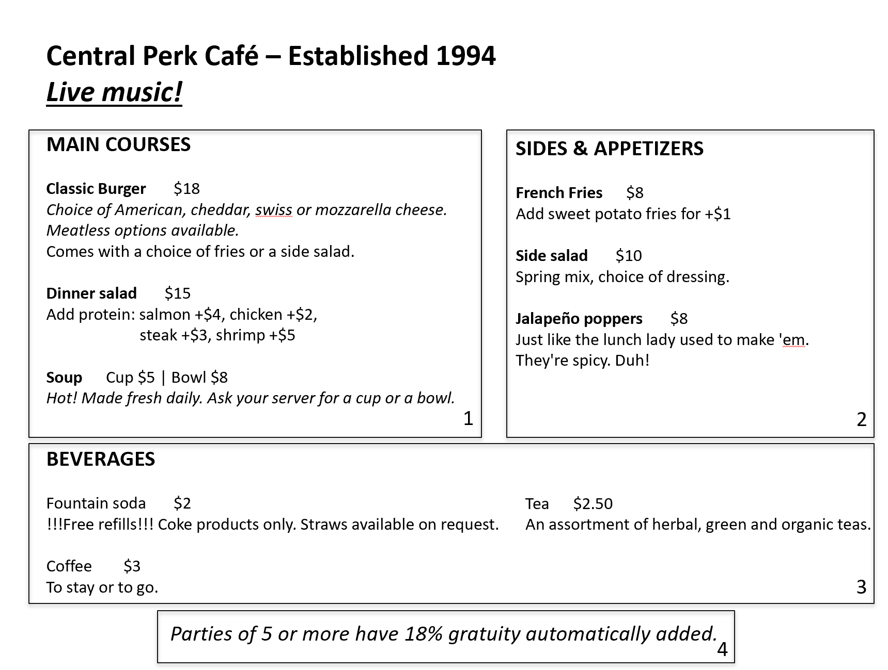

# HW1 Information Design (EASY)

## A) PowerPoint-style layout

### Overall slide structure



## B) Conceptual groups

### Group 1: MAIN COURSES
**Viewing order: 1**  
**Concept name: Main Courses / Entrées**

Included items:
- Classic Burger
- Dinner salad
- Soup

**Reasoning:** This is the primary decision for diners and should appear first. It contains complete meal options with higher prices and is the core of the ordering decision.

---

### Group 2: SIDES & APPETIZERS
**Viewing order: 2**  
**Concept name: Sides & Appetizers**

Included items:
- French Fries
- Side salad
- Jalapeño poppers

**Reasoning:** These items complement the main courses or can be ordered as small bites. Guests usually consider them after choosing a main to complete or upgrade the meal.

---

### Group 3: BEVERAGES
**Viewing order: 3**  
**Concept name: Beverages / Drinks**

Included items:
- Fountain soda
- Tea
- Coffee

**Reasoning:** Drinks are typically chosen near the end of the decision process, after food choices are made. They are simpler, lower-priced items and can be scanned quickly.

---

### Group 4: RESTAURANT INFORMATION & POLICIES
**Viewing order: 4**  
**Concept name: Restaurant Information & Policies**

Included items:
- Central Perk Café – Established 1994 (name & history)
- Live music! (experience/feature)
- Parties of 5 or more have 18% gratuity automatically added (policy note)

**Reasoning:** These details are not required to make a quick ordering decision but support the brand and set expectations. Placing them last avoids interrupting the ordering flow.

---

## C) Short answers

### 1) Who is reading this information?

**Answer:** Dine-in guests at the café who need to decide what to order, especially people who want to make a quick ordering decision. This may include:
- Office workers eating alone
- Groups of friends meeting up
- Family members dining together
- Anyone who needs to choose food within a limited time

### 2) In what situation are they reading it, and what is their main goal?

**Answer:**  
- **Situation:** The guest is seated at a restaurant table, looking at the menu while a server is waiting (or about to come) to take their order. The environment may be a bit noisy, and they do not want to spend too long reading.  
- **Main goals:**  
  1. Quickly find a main dish that looks appealing  
  2. Understand prices and options (such as sides or added protein)  
  3. Build a complete meal (main + sides + drink)  
  4. Notice any important notes (free refills, spice warnings, automatic gratuity, etc.)

---

## Redesigned menu text (with hierarchy)

```
                    Central Perk Café – Established 1994
                            Live music!

MAIN COURSES

  Classic Burger
  Choice of American, cheddar, swiss or mozzarella cheese.
  Meatless options available.
  Comes with a choice of fries or a side salad.
  $18

  Dinner salad
  Add protein: salmon +$4, chicken +$2, steak +$3, shrimp +$5
  $15

  Soup
  Hot! Made fresh daily. Ask your server for a cup or a bowl.
  Cup $5 | Bowl $8

SIDES & APPETIZERS

  French Fries
  $8
  Add sweet potato fries for +$1

  Side salad
  Spring mix, choice of dressing.
  $10

  Jalapeño poppers
  Just like the lunch lady used to make 'em. They're spicy. Duh!
  $8

BEVERAGES

  Fountain soda
  !!!Free refills!!! Coke products only. Straws available on request.
  $2

  Tea
  An assortment of herbal, green and organic teas.
  $2.50

  Coffee
  To stay or to go.
  $3

Parties of 5 or more have 18% gratuity automatically added.
```
